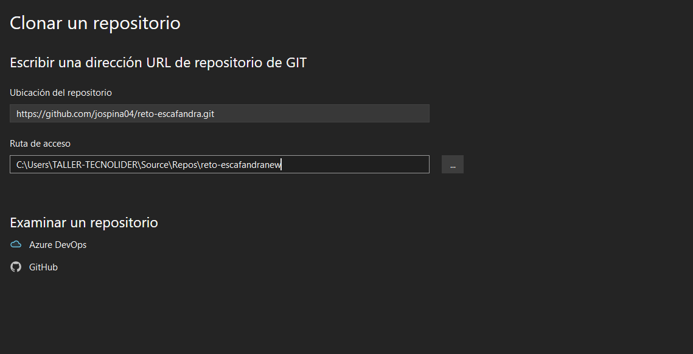
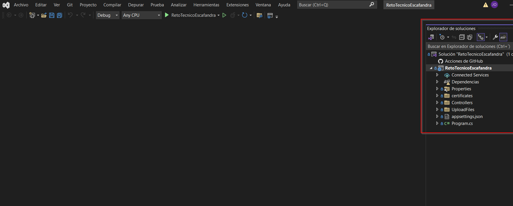
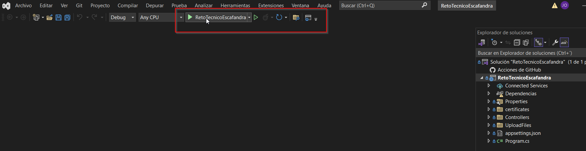
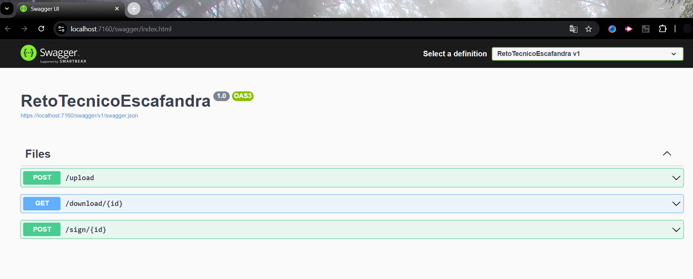

# Reto técnico para Empresa Escafandra por Jimena Ospina Vergara

Código para carga, descarga y firma de documentos PDF utilizando una arquitectura orientada a Microservicios.

## Intrucciones de ejecución recomendadas

Prerrequisitos: 

- Microsoft Visual Studio
- .Net Core 6

Paso a paso de ejecución:

1. Clonar el repositorio usando Microsoft Visual Studio:

2. Esto nos llevara al proyecto en el IDE:

3. Ejecutamos el proyecto:

Y este nos levanta el navegador en el localhost y nos lleva a la documentación de las APIs en Swagger.

# Notas Adicionales:

- Se enviaran por correo eléctronico dos archivos. Uno para documentación referente a patrones, tecnologías, y librerías utilizadas en el proyecto, y otro archivo con las evidencias del programa con pruebas realizadas en Postman.

- En la ubicación "RetoTecnicoEscafandra\UploadFiles" quedan los documentos subidos utilizando los microservicios. El plan de mejora a futuro es guardar esto en un Bucket S3 de AWS de esta forma: [AWS SDK S3 para .NET](https://docs.aws.amazon.com/sdk-for-net/v3/developer-guide/csharp_s3_code_examples.html) y así quedar con esta capa de persistencia.

- Este repositorio solo contiene el backend de la aplicación.

- En la ubicación "RetoTecnicoEscafandra\certificates" se encuentra el certificado autofirmado utilizado para el proyecto. Al ser un certificado solo usado para pruebas locales se deja allí y se quema la contraseña en el código.